 

---

## 👨🏻‍💻 Sobre mim

<table>
  <tr>
    <td align="center" width="33%"><h2>6 anos</h2>em&nbsp;tecnologia</td>
    <td align="center" width="33%"><h2>+4 anos</h2>como&nbsp;desenvolvedor</td>
    <td align="center" width="33%"><h2>+30</h2>projetos&nbsp;entregues</td>
  </tr>
</table>

Crio **sistemas, sites, aplicativos e automações com IA** sob medida, do front-end à API.

- 💼 Hoje sou **Desenvolvedor Full Stack na AI Factory NOCLAF Tech** e construo plataformas web completas com IA no fluxo de desenvolvimento.
- 🏥 Passei mais de 3 anos na **MV Sistemas**, criando aplicações web de grande escala para a área da saúde.
- ☁️ Comecei em infraestrutura cloud e suporte na **Alterdata Software**, cuidando de servidores em nuvem e bancos de dados.

---

## 🤖 IA no meu dia a dia

A IA faz parte de todo o meu trabalho: está no meu jeito de programar e dentro dos produtos que eu entrego.

<table>
  <tr>
    <td width="33%" valign="top" align="center">
      <h3>⚡ Desenvolvo com IA</h3>
      
      
        
      Agentes de código no fluxo diário, do planejamento ao review, para entregar mais rápido sem perder qualidade.
    </td>
    <td width="33%" valign="top" align="center">
      <h3>🧠 Construo com IA</h3>
      
      
        
      Recursos inteligentes dentro dos produtos, como um assistente que gera planos de aula e uma plataforma de educação médica com IA.
    </td>
    <td width="33%" valign="top" align="center">
      <h3>💬 Automatizo com IA</h3>
      
        
      Agentes de atendimento que respondem, qualificam e agendam 24 horas por dia.
    </td>
  </tr>
</table>

---

## 🛠️ Tech Stack

  

  
  

---

## 📬 Vamos conversar?

Tem um projeto de **sistema, site, app ou automação com IA**? Me chama! 🚀

